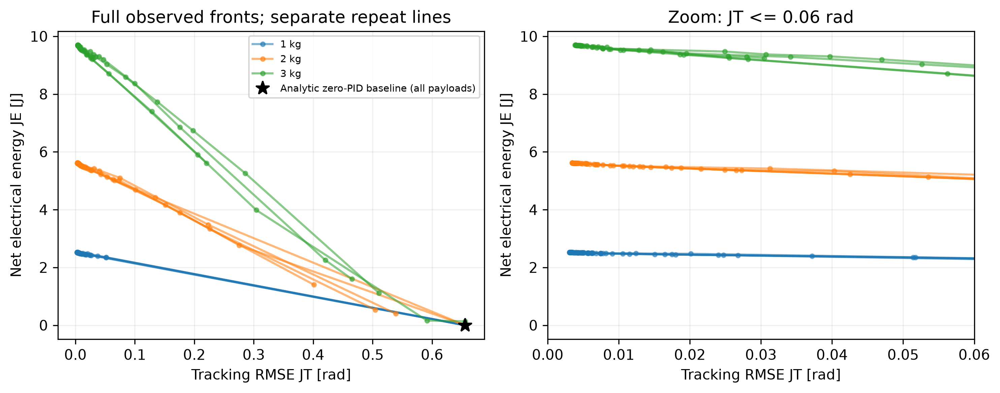
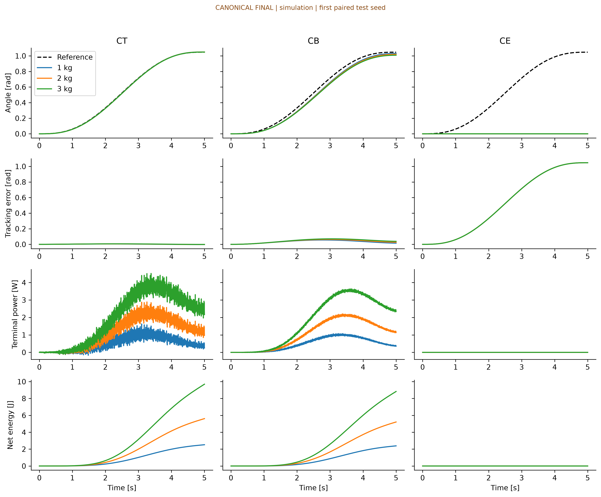

# Canonical Final Model — 실험 결과

Experiment 1·2 완료. Experiment 3은 수행하지 않았습니다. 이전 illustrative 결과는 포함하지 않습니다.
설정 SHA256: `9ddca9831628a34dc49075d4362fe0d1c6ccc78f03ded0e255fe2848495707c0`. 물리값은 사용자 지정 연구 모델이며 하드웨어 검증값으로 주장하지 않습니다.

## Table 1 — Common simulation conditions

| Condition | Value |
| --- | --- |
| Motor / gear | RE35 323890 / GP42C |
| N / eta | 126 / 0.72 |
| R / L | 0.568 ohm / 0.000191 H |
| Kt / Ke | 0.0292 Nm/A / 0.0291 Vs/rad |
| Jm / Jg | 8.12e-6 / 1.4e-6 kg m^2 |
| Link l / m / COM | 0.20 m / 0.50 kg / 0.10 m |
| Payload / tip radius | 1, 2, 3 kg / 0.20 m |
| Jeq (1, 2, 3 kg) | 0.19780619, 0.23780619, 0.27780619 kg m^2 |
| b / g | 0.05 Nm s/rad / 9.81 m/s^2 |
| Voltage / current constraint | 24 V / 3.84 A (absolute peak) |
| Trajectory | quintic, 0 to 60 degrees over full 5 s; no hold |
| Control / RK4 step | 1 ms / 62.5 microseconds |
| PID bounds Kp / Ki / Kd | [0,200] / [0,100] / [0,20] |
| Noise variance / sampling | 1e-7 rad^2 / 1 ms |
| Acquisition / repeats / evaluations | qLogNEHVI / 5 / 40 (10 initial) per payload |
| Train / selection / test seeds | 3 / 5 / 10 per repeat |
| HV reference / scales | [1 rad,20 J] / [0.1 rad,10 J] |

## Experiment 1

각 payload를 독립 최적화했습니다. 표의 mean/std는 optimization repeat 5개의 통계입니다.
최적화 1,800 rollout + 독립 selection 재평가 3,000 rollout. Experiment 1 소요시간 479.7초.

| payload | Pareto_mean | Pareto_std | min_JT_mean | min_JT_std | seconds_mean |
| --- | --- | --- | --- | --- | --- |
| 1 | 12.8 | 1.9235 | 0.0031232 | 5.6404e-05 | 28.744 |
| 2 | 13.6 | 2.9665 | 0.0034794 | 8.1749e-05 | 34.571 |
| 3 | 13.6 | 1.1402 | 0.0040671 | 0.00035506 | 32.614 |

곡선은 관측 점을 연결한 시각적 가이드이며 연속 최적 front의 증명이 아닙니다.
검은 별은 모든 payload에서 알려진 zero-PID baseline입니다. 원래 MOBO front나 retention 계산에 사후 추가하지 않았습니다.

### 같은 tracking 예산에서의 에너지 비교

`JT <= 0.01 rad`를 만족하는 관측 front 중 최소 JE입니다. 정확히 같은 JT에서 보간한 값이 아닙니다.
이 예산은 결과 설명용이며 controller 선택이나 학습에는 사용하지 않았습니다.

| payload | mean | std | count |
| --- | --- | --- | --- |
| 1 | 2.4842 | 0.004132 | 5 |
| 2 | 5.5463 | 0.019563 | 5 |
| 3 | 9.5811 | 0.027765 | 5 |

반대로 같은 JE 예산에서의 JT 비교는 `common_budget_comparison.csv`에 겹치는 관측 범위만 기록했습니다.
빈 비교는 예산 안에서 관측한 점이 없다는 뜻이며 물리적 불가능의 증명이 아닙니다.

## Table 2 — Cross-payload transfer

전체 nominal front를 고정하여 재평가한 집합 지표입니다. 평균 ± 표준편차의 표본 수는 5입니다.
R_P는 전이 집합 내부 비지배 유지율, L_HV는 같은 기준점을 사용한 local 대비 상대 hypervolume 차이(%)입니다.

| payload | R_P_mean | R_P_std | L_HV_mean | L_HV_std |
| --- | --- | --- | --- | --- |
| 1 | 100 | 0 | 0 | 0 |
| 2 | 93.31 | 6.9967 | 4.9218 | 1.6773 |
| 3 | 87.316 | 7.0198 | 0.13215 | 19.869 |

## CT / CB / CE — repeat 0 예시

이 반복을 대표 예시로 미리 정한 순서상 첫 번째로 표시합니다. 전체 5회 결과는 `representative_performance.csv`에 있습니다.
각 수치는 독립 test seed 10개의 평균이며, 변화율의 기준은 같은 controller의 1 kg입니다.

| role | payload | kp | ki | kd | JT | JE | delta_JT_pct | delta_JE_pct | feasible |
| --- | --- | --- | --- | --- | --- | --- | --- | --- | --- |
| CT | 1 | 200 | 100 | 0 | 0.0031007 | 2.5224 | 0 | 0 | True |
| CB | 1 | 30.364 | 0 | 0 | 0.037191 | 2.3882 | 0 | 0 | True |
| CE | 1 | 0 | 0 | 0 | 0.65546 | 0 | 0 | — | True |
| CT | 2 | 200 | 100 | 0 | 0.0034439 | 5.6152 | 11.069 | 122.61 | True |
| CB | 2 | 30.364 | 0 | 0 | 0.04321 | 5.2169 | 16.185 | 118.44 | True |
| CE | 2 | 0 | 0 | 0 | 0.65546 | 0 | 0 | — | True |
| CT | 3 | 200 | 100 | 0 | 0.00385 | 9.6923 | 24.166 | 284.25 | True |
| CB | 3 | 30.364 | 0 | 0 | 0.049417 | 8.831 | 32.872 | 269.77 | True |
| CE | 3 | 0 | 0 | 0 | 0.65546 | 0 | 0 | — | True |

Fig. 2는 첫 paired test seed의 응답입니다. 각 열은 같은 PID를 모든 payload에 그대로 적용합니다.

## 논문 해석에 필요한 피드백

1. **CE의 퇴화 해:** 모든 nominal 반복에서 CE는 [0,0,0], JE=0 J, JT≈0.65546 rad입니다.
   아래쪽 정지 상태에서 움직이지 않으므로 payload 영향도 없습니다. 이를 유용한 에너지 절감이나 robustness로 해석하면 안 됩니다.
   JE 변화율은 0으로 나누게 되어 정의되지 않으며 표에서 누락값으로 표시했습니다.
   유용한 CE 비교가 필요하면 후속 프로토콜에서 tracking/terminal-error 허용조건을 사전에 정하거나,
   사전에 정의한 실용 tracking 구간에서 세 controller를 선택해야 합니다. 현재 결과를 사후 교체하지 않았습니다.
2. **탐색 범위와 수렴:** nominal CT의 Kp는 모든 반복에서 상한 200이고 Ki도 대부분 상한 100입니다.
   전역 최적을 찾았다는 증거가 없으며 gain 경계 민감도 검토가 필요합니다. Pareto 개수가 많다는 사실만으로 수렴을 주장할 수 없습니다.
   일부 고-payload local 탐색은 알려진 zero-PID 에너지 극점조차 발견하지 못했습니다.
3. **HV 결과의 불안정성:** 3 kg L_HV 표준편차가 약 19.9 percentage points로 큽니다.
   음수 HV loss는 유한 예산의 local 비교 집합보다 전이 집합이 더 큰 HV를 얻었다는 뜻입니다.
   물리적 성능 향상이나 강건성 증명으로 단정하지 말고 front coverage 차이와 함께 해석해야 합니다.
4. **5초의 의미:** 5초 전체가 이동 궤적이며 종료 후 유지 구간은 없습니다. 지정된 유한시간 목적 비교에는 맞지만
   정착시간·정상상태 유지 전력·장시간 열적 성능을 평가하지 않습니다. 그런 주장은 추가 hold 실험이 필요합니다.
5. **물리 모델 범위:** 지정한 일정 효율 감속기 식, 전압 PID, 전류 feasibility 조건의 시뮬레이션입니다.
   실제 GP42C 역구동 손실, peak torque, 열 및 드라이버 한계는 검증하지 않았습니다.

22개 자동 검증 통과. Pilot에서 적분 간격을 절반으로 줄였을 때 최대 JE 차이는 약 2.3e-7 J였습니다.
qNEHVI NaN 및 초기 GP 학습 실패 시도는 보관하되 이 표에서 제외했습니다. 최종 실행은 같은 정규화·prior·bounds의 qLogNEHVI입니다.
`manifest_*.json`의 Git revision은 실행 당시 로컬 base commit이며 실제 변경 코드의 SHA256도 함께 기록했습니다.

## 재현 및 원자료

실험: `kroc-mobo all --config configs/canonical_final.toml --out results/new-run`

보고서: `python analysis/build_report.py --out results/new-run --report reports/new-run`

전체 원자료·코드·실행 로그는 이 작업의 응답에 제공한 `canonical-final-results.zip`에 포함되어 있습니다.
GitHub 웹 업로드의 파일 크기 제한으로 원자료 ZIP은 이 디렉터리에 게시하지 않았습니다.
이 디렉터리에는 설정 snapshot, manifest, 결과표, 모든 반복의 그림과 검증 기록을 제공합니다.
