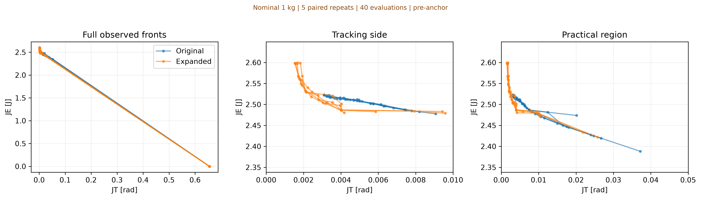
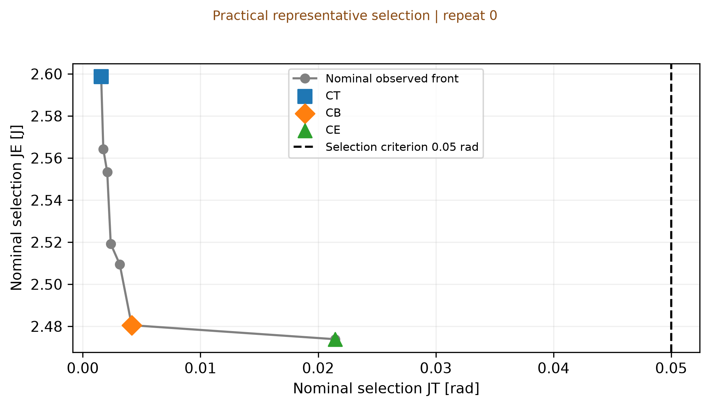
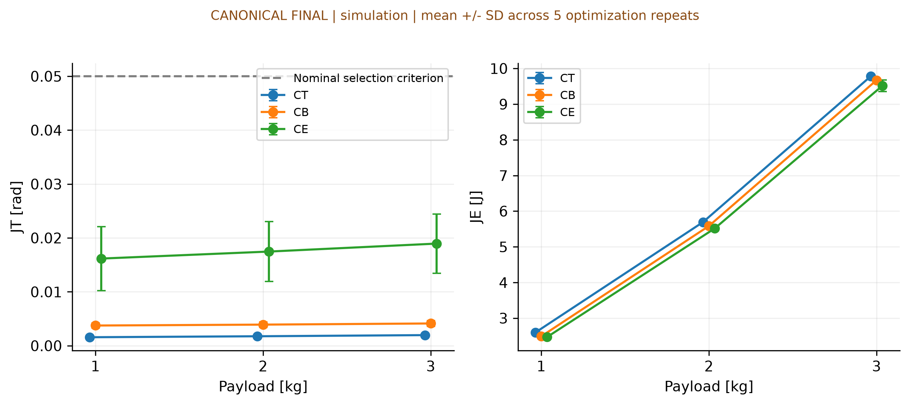
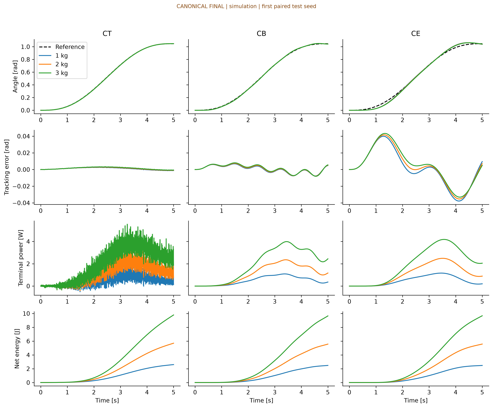

# Canonical Final Model — revised Experiment 1·2

2026-09-24 revision. **Step 1 판정: expanded bounds 채택**. Experiment 1·2를 모두 새로 실행했다.
Experiment 3은 수행하지 않았다. 모델은 기존 **1-DOF geared joint**이며, 참고 대화 제목의
3-DOF 시스템에 대한 결과로 해석하지 않는다. 물리값은 사용자 지정 연구 모델이다.

- Run: `results/canonical-revision-20260924`
- Config SHA256: `17919d5b47544ee8bf2848f597848061a0c0e4f7da1ad592bd4dd2131a99fa5f`
- 실험 code commit: `ef04ab65afdda6eb9093d451c917484af1e56d30`; manifest의 source SHA256으로 실행 코드를 식별한다.
- 이전 보고서 전체: [2026-09-23 archive](../archive/canonical-final-20260923/REPORT.md).
  이전 raw run `results/canonical-final-qlog-v3`와 원본 ZIP도 그대로 보존했다.
- 사전 고정한 설계: [REVISION_PROTOCOL.md](../../docs/REVISION_PROTOCOL.md).

## Step 1 — 1 kg gain-bound sensitivity

두 arm 모두 5 repeats × 40 evaluations (10 initial Sobol), train/selection noise seeds 3/5개로
동일하게 실행했다. Bounds 이외의 모델·optimizer·seed는 동일하다. 이 비교는 Step 2 전
프로토콜을 사용하므로 두 arm 모두 새 zero anchor를 강제하지 않았다. 이후 canonical
재실행은 anchor를 포함하므로 sensitivity arm 결과와 canonical 결과를 섞지 않는다.

Primary improvement는 **repeat별 최소 JT의 평균** 사이 상대 감소율이다. 기준은 개선 ≥5%
또는 expanded CT의 어느 gain이든 기존 상한을 기존 범위의 1%보다 크게 초과하면 expanded 채택이다.
기존 bounds 유지는 개선 <5%, 명백한 범위 이탈 없음, front near-overlap을 모두 만족할 때만 허용한다.
Near-overlap은 tracking(JT≤0.01) 및 practical(JT≤0.05) 구간의 paired pooled-range 정규화
bidirectional discrete Hausdorff 거리 ≤0.05가 모든 반복에서 성립하는 것으로 사전 정의했다.
기준 미충족 시 보수적으로 expanded를 채택한다. 이는 통계적 유의성 검정이 아니다.

**결과: 0.00312323 → 0.00162294 rad,
48.04% 개선. 5/5회가 기존 bounds 밖.**
따라서 canonical upper bounds를 **[400,200,40]**으로 바꾸고 모든 payload를 재실행했다.
새 CT가 expanded 상한 0.1% 이내인 반복도 4/5회다.
이 확인은 기존 bounds의 영향을 입증하지만, 확장 후 bounds 독립성이나 전역 최적을 입증하지 않는다.

| repeat | original_min_JT | expanded_min_JT | improvement_pct | expanded_CT_outside_old | expanded_CT_at_upper |
| --- | --- | --- | --- | --- | --- |
| 0 | 0.00309563 | 0.00154512 | 50.0871 | True | True |
| 1 | 0.00310139 | 0.00178778 | 42.3555 | True | False |
| 2 | 0.00309842 | 0.00167449 | 45.9565 | True | True |
| 3 | 0.00309665 | 0.00154615 | 50.0703 | True | True |
| 4 | 0.00322405 | 0.00156114 | 51.5783 | True | True |



점 사이 선은 관측 연결선이다. 상세 gains는 `sensitivity/tracking_extremes.csv`,
고정 JT 예산 0.005/0.01/0.02/0.05 rad의 관측 최소 JE는
`sensitivity/tracking_budget_comparison.csv`에 기록했다. Practical front coverage 및
에너지 극점은 유한 예산 때문에 달라질 수 있다. 빠른 tracking 개선을 front 전체 우월성으로 해석하지 않는다.
자동 분기와 모든 기준은 `sensitivity/decision.json`에 보존했다.

Practical 영역의 coverage와 관측 최소 JE는 다음과 같다. 에너지 쪽 개선을 일괄 주장하지 않는다.

| arm | practical_count_mean | practical_min_JE_mean | practical_min_JE_std |
| --- | --- | --- | --- |
| original | 11.4 | 2.42667 | 0.0306441 |
| expanded | 8.4 | 2.4578 | 0.0278998 |

Tracking-side 정규화 Hausdorff 거리는 0.491–0.739,
practical-region 거리는 0.283–0.902였다.
모두 사전 near-overlap 기준 0.05를 넘었다. 개별 반복 값은 `sensitivity/per_repeat.csv`에 있다.

## Table 1 — common conditions

| Condition | Value |
| --- | --- |
| Model | 1-DOF geared joint; RE35 323890 / GP42C |
| N / eta | 126 / 0.72 |
| R / L | 0.568 ohm / 0.000191 H |
| Kt / Ke | 0.0292 Nm/A / 0.0291 Vs/rad |
| Jm / Jg | 8.12e-6 / 1.4e-6 kg m^2 |
| Link l / mass / COM / payload radius | 0.20 m / 0.50 kg / 0.10 m / 0.20 m |
| Payloads / nominal | 1, 2, 3 kg / 1 kg |
| Jeq (1, 2, 3 kg) | 0.19780619, 0.23780619, 0.27780619 kg m^2 |
| b / g | 0.05 Nm s/rad / 9.81 m/s^2 |
| Voltage / current | ±24 V saturation / ±3.84 A peak feasibility, no current clipping |
| Trajectory / horizon | quintic 0→60 deg over full 5 s, no hold |
| Control / RK4 step | 1 ms / 62.5 microseconds |
| PID bounds Kp / Ki / Kd | [0.0, 400.0] / [0.0, 200.0] / [0.0, 40.0] |
| Noise variance / sampling | 1e-7 rad^2 / 1 ms |
| Acquisition / repeats / evaluations | qLogNEHVI / 5 / 40 per payload |
| Initial design | 1 zero-PID anchor + 9 Sobol = 10 included in 40 |
| Train / selection / test replicates | 3 / 5 / 10; disjoint phase seeds, paired payload seeds |
| Representative tracking criterion | JT <= 0.05 rad; selection only |
| HV reference / scales (supplementary) | [1 rad,20 J] / [0.1 rad,10 J] |

전류는 clipping하지 않고 한계 위반 여부를 기록한다. `feasible`은 평가한 모든 noise rollout에서
전류·각도·속도 및 수치 유효성 제약을 만족했다는 뜻이다. 무한시간 안정성 보증은 아니다.

## Experiment 1 — independent payload fronts

각 payload를 독립 최적화했다. 각 repeat의 initial 10점은 **zero PID 1점 + Sobol 9점**이다.
Anchor도 40회 평가 예산에 포함하며 train/selection에 똑같이 평가한다. 이미 끝난 front에 사후 추가하지 않았다.
Full Pareto front는 practical criterion으로 잘라내지 않는다.
최적화 rollout 1,800개,
독립 selection 재평가 3,000개.
실행시간 788.8초. 아래 SD는 optimization repeats n=5의 변동이다.

| payload | Pareto_mean | Pareto_std | feasible_mean | feasible_std | min_JT_mean | min_JT_std | seconds_mean |
| --- | --- | --- | --- | --- | --- | --- | --- |
| 1 | 10.2 | 2.86356 | 36 | 0.707107 | 0.00157706 | 5.63203e-05 | 32.5448 |
| 2 | 10 | 2 | 35.4 | 0.547723 | 0.00293355 | 0.00072544 | 55.1385 |
| 3 | 14.4 | 1.94936 | 33.8 | 0.83666 | 0.00335781 | 0.000476147 | 70.0754 |


별표는 실제 초기 설계에서 평가한 zero anchor이다. 각 선은 하나의 독립 반복이며 pooled super-front가 아니다.
JT=약 0.65546 rad, JE=0인 zero PID는 움직이지 않는 baseline으로 남기되 CT/CB/CE 후보에서는 제외했다.

JT≤0.01 rad라는 공통 tracking 예산에서의 관측 최소 JE:

| payload | mean | std | count |
| --- | --- | --- | --- |
| 1 | 2.48348 | 0.00309609 | 5 |
| 2 | 5.56684 | 0.0298563 | 5 |
| 3 | 9.67701 | 0.0418919 | 5 |

이 예산은 결과 설명용이며 대표 선택 기준 0.05 rad와 다르다. 정확히 같은 JT에서의 보간이나
연속 front의 추정이 아니다. 빈 구간은 관측 coverage 부족이며 물리적 불가능의 증거가 아니다.

## Steps 3–4 — practical CT/CB/CE selection

**JT≤0.05 rad RMSE(약 2.865°)**를 revised run 전에 설정했다.
이는 **대표 controller 선택용 practical criterion이며 Pareto front 자체를 잘라내지 않는다**.
하드웨어에서 검증한 허용오차는 아니다. Nominal 1 kg의 feasible selection Pareto front에서
이 조건을 만족하고 gains가 [0,0,0]이 아닌 subset만 사용한다.

- CT: minimum JT; ties by JE, Kp, Ki, Kd.
- CE: minimum JE subject to JT≤0.05; ties by JT, Kp, Ki, Kd.
- CB: 같은 practical subset의 min/max로 JT와 JE를 각각 [0,1]에 정규화하고,
  utopia (0,0)까지 Euclidean distance가 최소인 점. Zero-range 축은 0으로 둔다.
  Ties by JT, JE, Kp, Ki, Kd. 기하학적 knee로 주장하지 않는다.

정확한 정의가 같은 점을 고르면 role 중복을 그대로 보고한다. 이번 선택의 상태:
`{0: 'ok', 1: 'ok', 2: 'ok', 3: 'ok', 4: 'ok'}`. 모든 gains·selection JT/JE·정규화 경계·거리·후보 수는
`representatives_frozen.csv`에 저장했고, 해당 repeat의 target test 평가 전에 동결했다.
Selection 값과 아래의 독립 test 성능은 구별한다.

| repeat | role | kp | ki | kd | JT | JE | utopia_distance | practical_candidate_count | selection_status |
| --- | --- | --- | --- | --- | --- | --- | --- | --- | --- |
| 0 | CT | 400 | 194.599 | 0 | 0.00156159 | 2.59871 | 1 | 7 | ok |
| 0 | CB | 0 | 192.023 | 0 | 0.00415469 | 2.48054 | 0.140984 | 7 | ok |
| 0 | CE | 0 | 41.0828 | 0 | 0.0214289 | 2.47388 | 1 | 7 | ok |
| 1 | CT | 400 | 200 | 0 | 0.00155089 | 2.5992 | 1 | 9 | ok |
| 1 | CB | 0 | 200 | 0 | 0.00401421 | 2.4866 | 0.302433 | 9 | ok |
| 1 | CE | 65.5307 | 0 | 0 | 0.0174118 | 2.44714 | 1 | 9 | ok |
| 2 | CT | 400 | 161.487 | 0 | 0.00167728 | 2.59944 | 1 | 9 | ok |
| 2 | CB | 64.4925 | 200 | 0 | 0.00314472 | 2.50239 | 0.245126 | 9 | ok |
| 2 | CE | 110.341 | 0 | 1.02599 | 0.0127173 | 2.47721 | 1 | 9 | ok |
| 3 | CT | 400 | 200 | 0 | 0.00154615 | 2.59786 | 1 | 14 | ok |
| 3 | CB | 0 | 190.22 | 0 | 0.00420439 | 2.47987 | 0.140921 | 14 | ok |
| 3 | CE | 0 | 40.9094 | 0 | 0.021548 | 2.47407 | 1 | 14 | ok |
| 4 | CT | 400 | 200 | 0 | 0.00154942 | 2.59707 | 1 | 7 | ok |
| 4 | CB | 51.4489 | 197.75 | 0 | 0.0032635 | 2.50085 | 0.311357 | 7 | ok |
| 4 | CE | 147.41 | 0 | 0 | 0.00777183 | 2.48452 | 1 | 7 | ok |



## Step 5 / Table 2 — primary cross-payload results

Nominal에서 고른 gains를 **retuning 없이 1/2/3 kg**에 적용했다. 각 repeat의 성능은
10개 독립 test seed 평균이며 아래 ±는 그 평균들의 반복 간 SD(n=5)이다.
변화율은 먼저 각 repeat/controller의 1 kg 대비 계산한 뒤 평균했다.
`delta_J_pct = 100*(J(payload)-J(1kg))/J(1kg)`; 0 분모는 undefined로 둔다.
`practical_satisfied`는 test 평균 JT와 물리적 feasibility를 함께 확인하는 별도 진단이다.

| role | payload | JT_rad | JE_J | delta_JT_pct | delta_JE_pct | feasible | practical_satisfied |
| --- | --- | --- | --- | --- | --- | --- | --- |
| CT | 1 | 0.0015778 ± 5.6065e-05 | 2.5975 ± 0.00086243 | 0 ± 0 | 0 ± 0 | 5/5 | 5/5 |
| CB | 1 | 0.003749 ± 0.00050324 | 2.4901 ± 0.010769 | 0 ± 0 | 0 ± 0 | 5/5 | 5/5 |
| CE | 1 | 0.016174 ± 0.0059277 | 2.4713 ± 0.014171 | 0 ± 0 | 0 ± 0 | 5/5 | 5/5 |
| CT | 2 | 0.0017574 ± 7.1597e-05 | 5.6933 ± 0.001178 | 11.365 ± 0.55555 | 119.19 ± 0.038757 | 5/5 | 5/5 |
| CB | 2 | 0.0039184 ± 0.00051556 | 5.5841 ± 0.018954 | 4.55 ± 0.31827 | 124.25 ± 0.2091 | 5/5 | 5/5 |
| CE | 2 | 0.017473 ± 0.0055545 | 5.5165 ± 0.064085 | 10.011 ± 8.2641 | 123.22 ± 1.8728 | 5/5 | 5/5 |
| CT | 3 | 0.0019688 ± 8.7624e-05 | 9.7796 ± 0.0021075 | 24.752 ± 1.0723 | 276.51 ± 0.087584 | 5/5 | 5/5 |
| CB | 3 | 0.004132 ± 0.00052514 | 9.6714 ± 0.027434 | 10.303 ± 0.86204 | 288.4 ± 0.579 | 5/5 | 5/5 |
| CE | 3 | 0.018952 ± 0.0054871 | 9.5165 ± 0.16217 | 21.036 ± 16.113 | 285.07 ± 5.3904 | 5/5 | 5/5 |



### Repeat 0 — preselected example

실행 순서상 첫 repeat를 예시로 고정했다. 다른 repeat보다 유리해서 고른 것이 아니다.

| role | payload | kp | ki | kd | JT | JE | delta_JT_pct | delta_JE_pct | feasible | practical_satisfied |
| --- | --- | --- | --- | --- | --- | --- | --- | --- | --- | --- |
| CT | 1 | 400 | 194.599 | 0 | 0.00156676 | 2.5976 | 0 | 0 | True | True |
| CB | 1 | 0 | 192.023 | 0 | 0.00416146 | 2.48046 | 0 | 0 | True | True |
| CE | 1 | 0 | 41.0828 | 0 | 0.0214335 | 2.4738 | 0 | 0 | True | True |
| CT | 2 | 400 | 194.599 | 0 | 0.00174311 | 5.69377 | 11.2561 | 119.194 | True | True |
| CB | 2 | 0 | 192.023 | 0 | 0.00433848 | 5.56699 | 4.25374 | 124.433 | True | True |
| CE | 2 | 0 | 41.0828 | 0 | 0.0216695 | 5.57193 | 1.10102 | 125.237 | True | True |
| CT | 3 | 400 | 194.599 | 0 | 0.00195117 | 9.78055 | 24.5359 | 276.523 | True | True |
| CB | 3 | 0 | 192.023 | 0 | 0.00455749 | 9.64655 | 9.51673 | 288.901 | True | True |
| CE | 3 | 0 | 41.0828 | 0 | 0.0222244 | 9.66776 | 3.68994 | 290.805 | True | True |



응답 그림은 repeat 0의 첫 paired test seed이다. 모든 5회 그림과 raw test rollout은 함께 보존했다.

### Finite-budget local tracking coverage

동일한 test seeds에서 local selection front를 재평가한 최소 JT와 전이 CT의 JT를 비교했다.
2/3 kg의 총 10개 repeat 조건 중
10개에서 전이 CT의 JT가 더 작았다.
따라서 독립 local search의 관측 최소 JT를 해당 payload의 최적 추종 한계로 해석하면 안 된다.
이는 40회 예산에서 tracking 쪽 탐색 coverage가 충분하지 않음을 보여준다. JE가 다르므로
전이 controller가 local front 전체를 지배한다는 뜻도 아니다. 이 진단을 보고한 뒤 local
front에 전이 CT를 사후 추가하거나 추가 최적화하지 않았다.

| payload | local_retested_min_JT | transferred_CT_JT |
| --- | --- | --- |
| 1 | 0.00157781 | 0.00157781 |
| 2 | 0.00293424 | 0.00175738 |
| 3 | 0.00335813 | 0.00196882 |

상세 paired 비교는 `local_tracking_coverage_diagnostic.csv`에 있다.

## Supplementary — retention and HV

Retention/HV는 **보조지표**다. Primary evidence는 위 JT·JE·within-controller 변화율·feasibility이다.
전체 nominal front를 전이한 집합을 사용하므로 zero anchor도 포함된다. 모든 local front 역시
같은 anchor를 초기 설계에 포함해 baseline coverage 비대칭을 줄였다. 이것만으로 나머지 front
coverage나 유한 탐색 예산에 따른 불확실성까지 제거되지는 않는다.

| payload | R_P_mean | R_P_std | L_HV_mean | L_HV_std |
| --- | --- | --- | --- | --- |
| 1 | 100 | 0 | 0 | 0 |
| 2 | 96.1667 | 5.63964 | 2.87435 | 1.41772 |
| 3 | 94.1667 | 5.71305 | 15.6569 | 1.19203 |

R_P는 전이 집합 내부 비지배 유지율, L_HV는 같은 기준점으로 계산한 local 대비 상대 HV 차이(%)다.
음수 L_HV는 유한 예산 local comparator보다 transfer set의 관측 HV가 컸다는 뜻이다.
3 kg HV 변동이나 작은 평균 loss를 강건성 증명의 주 근거로 사용하지 않는다.
기존 `table2_transfer_*` 파일명은 호환용이며 그 내용도 모두 supplementary이다.

## Paper-ready quantitative findings

1. 1 kg paired bounds 비교에서 5회 평균 최소 JT는 0.0031232→0.0016229 rad로 48.04% 감소했다. Expanded CT 5/5회가 기존 범위 밖이며 4/5회는 새 상한에 접했다.

2. Revised independent fronts에서 JT≤0.01 rad를 만족하는 관측 최소 JE의 평균±SD는 1 kg: 2.4835±0.0031 J; 2 kg: 5.5668±0.0299 J; 3 kg: 9.6770±0.0419 J. 이는 공통 tracking 예산 비교이며 같은 JT에서의 보간값이 아니다.

3. Retuning 없는 CT의 3 kg JT는 0.0019688 ± 8.7624e-05 rad이고, 같은 controller의 1 kg 대비 JT 변화율은 24.75 ± 1.072%, JE 변화율은 276.5 ± 0.08758%였다.

4. CE의 3 kg JT는 0.018952 ± 0.0054871 rad였다. 3 kg에서 CT 대비 CE 에너지 절감률은 2.691 ± 1.653%였다. Practical criterion 충족은 5/5회로 별도 보고한다.

5. 모든 payload/repeat의 초기 설계 15/15개에 zero-PID anchor가 포함되었고 대표 선택의 zero PID는 0개였다. 대표 test 조건의 물리적 feasibility는 45/45, JT≤0.05 rad까지 충족한 조건은 45/45였다.

## Validation and provenance

Pilot의 적분 간격을 절반으로 줄인 비교에서 최대 |delta JE|는
2.26e-07 J였다. Expanded 대표 gains의 추가 수치 점검,
raw-result cross-check 및 archive checksum 검증은 `VALIDATION.txt`와 `audit/`에 기록한다.
실험 source manifest, config snapshot, seed 목록과 train/selection/test 원자료를 보존한다.
상세 로그에 남은 GP의 small-noise 경고는 고정 variance floor의 수치 경고이며 숨기지 않는다.
Optimizer 오류를 Sobol로 조용히 대체하지 않는다.

## LIMITATIONS

- **No hold:** 5초 전체가 이동이며 종료 후 hold는 없다. Settling time, 정상상태 유지 전력,
  장시간 운전을 평가하지 않는다.
- **Constant gear efficiency:** eta=0.72의 지정 식을 사용한다. 부하·속도 의존 손실과
  GP42C의 실제 역구동 손실/torque rating을 검증하지 않았다.
- **No thermal/backlash/detailed driver model:** 열, backlash, elasticity, 상세 드라이버,
  current loop 및 배터리 효율을 추가하지 않았다. JE는 signed motor-terminal energy이다.
- **Finite-budget and residual bounds:** revised canonical CT 5/5회가 expanded 상한에
  접한다. 전역 최적·bounds 독립성·탐색 수렴을 주장하지 않는다. 고정 40회 예산의 front coverage 한계가 있다.
  특히 2/3 kg의 모든 반복에서 전이 CT가 local comparator의 최소 JT보다 낮았으므로
  local front를 최적 성능 경계로 해석하지 않는다.
- **Selection criterion:** 0.05 rad는 대표 선택을 위한 연구 설계 기준이며 payload 전이 후의
  충족을 보장하지 않는다. 이 threshold를 만족하지 못한 target 결과도 그대로 보고했다.
- **Model scope:** 시뮬레이션 기반 1-DOF 결과이다. 3-DOF coupled system 및 실물 검증은 수행하지 않았다.

## Reproduction and deliverables

```sh
# Step 1 uses the preserved pre-anchor configs (include_zero_anchor is absent/false).
kroc-mobo exp1 --config configs/sensitivity_original.toml --out results/new-sensitivity/original
kroc-mobo exp1 --config configs/sensitivity_expanded.toml --out results/new-sensitivity/expanded
python -m kroc_mobo.sensitivity --original results/new-sensitivity/original --expanded results/new-sensitivity/expanded --out results/new-sensitivity/analysis
# Current canonical config records the observed expanded decision and the new anchor/selection rule.
kroc-mobo all --config configs/canonical_final.toml --out results/new-canonical
python analysis/build_report.py --out results/new-canonical --sensitivity results/new-sensitivity/analysis --report reports/new-canonical
python analysis/audit_revision.py --out results/new-canonical --audit reports/new-canonical/audit
```

실행/보고서 디렉터리의 기존 결과를 덮어쓰지 않도록 보호한다.
`raw-results.zip`에는 sensitivity 두 arm과 revised canonical의 원자료·traces·logs·source snapshot이 포함된다.
`ARTIFACTS.sha256.json`은 최종 전달 파일 inventory다. 이전 run은 archive와 별도 원본 디렉터리에 보존한다.

변경 파일과 커밋 요약: [CHANGE_SUMMARY.md](CHANGE_SUMMARY.md). 원자료: [raw-results.zip](raw-results.zip).
